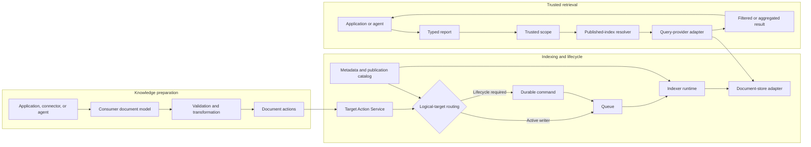
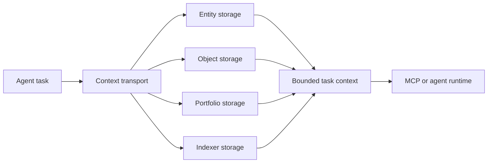
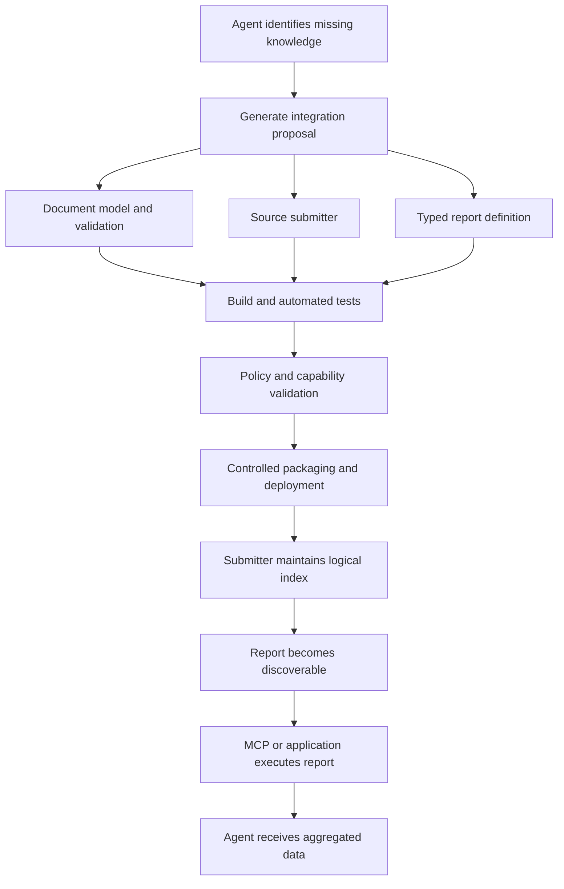
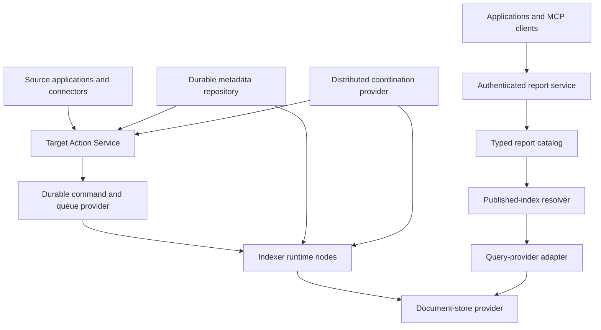

# inqwise-indexer

inqwise-indexer is a continuously maintained indexing and reporting module for
AI agents and data-intensive applications. It turns changing source data into
published knowledge projections and trusted, typed reports.

The project is part of a broader initiative exploring complementary entity,
object, portfolio, indexing, and context-transport capabilities for agents.
Within that architecture, inqwise-indexer is responsible for derived,
queryable knowledge: it routes live document changes, coordinates index
lifecycle and rebuilding, and returns filtered or aggregated data without
exposing physical storage details.

> [!IMPORTANT]
> The project is under active development. The included deployment uses
> in-memory persistence, queues, commands, and document storage. It is suitable
> for development and architecture evaluation, but is not yet a durable
> production deployment.

## Quick start

The repository includes a small Hacker News integration as a runnable reference.
It demonstrates a source submitter, consumer-owned document validation,
automatic indexing, provider discovery, and typed aggregate reports. Hacker News
is an example integration, not the purpose or intended scope of the library.

Requirements:

- JDK 21 or newer
- Maven
- Free local ports `3000`, `8080`, `8081`, `8083`, `8084`, `8086`, and `9090`

Build the combined example:

```sh
mvn -pl indexer-example-hacker-news-node-application -am package
```

Run it:

```sh
java -jar indexer-example-hacker-news-node-application/target/inqwise-hacker-news-indexer-node.jar \
	com.inqwise.indexer.example.hn.node.application.HackerNewsIndexerNodeApplicationVerticle \
	--options deployment/local/vertx-options.json \
	--conf deployment/local/indexer-node.json
```

Check readiness:

```sh
curl -fsS http://127.0.0.1:8084/health/ready
```

The operator console is available at <http://127.0.0.1:3000>.

Discover the reports packaged with the example:

```sh
curl -fsS http://127.0.0.1:8086/reports
```

After the source has indexed some documents, request an aggregate report:

```sh
curl -fsS \
	-X POST \
	http://127.0.0.1:8086/reports/hacker-news.story-authors/executions \
	-H 'content-type: application/json' \
	--data '{
		"from_inclusive": "2000-01-01T00:00:00Z",
		"to_exclusive": "2100-01-01T00:00:00Z",
		"minimum_score": 0,
		"limit": 10,
		"order_by": "total_score"
	}'
```

In this flow, source changes become validated document actions, the logical
target is provisioned, the runtime maintains its current index, and the report
returns a compact aggregation instead of raw source records.

## The problem

Agents and applications frequently require current domain knowledge that
cannot be handled well by prompts, conversation memory, or unrestricted
database access alone.

Several problems appear when that knowledge must be continuously indexed:

- Source data continues changing while an index is rebuilt.
- Historical data must be combined with live updates.
- Physical indexes, queues, and schemas change over time.
- Producers should address logical datasets, not physical resources.
- A replacement index must become visible without an unsafe intermediate state.
- Failed lifecycle operations must be retryable without duplicating resources.
- Queries must preserve trusted scope and schema compatibility.
- Agents need compact, task-specific results rather than raw-document dumps.
- A storage provider's query language should not become an unrestricted agent
  interface.

inqwise-indexer provides the boundaries and orchestration for this part of an
agent or application storage architecture.

## When it is suitable

inqwise-indexer is suitable for:

- Continuously updated search or reporting indexes.
- Logical datasets backed by replaceable physical indexes.
- Time-partitioned indexes.
- Historical loads and reindexing while live writes continue.
- Controlled publication and retirement of index versions.
- Typed filters, projections, calculations, and aggregate reports.
- Multiple consumer domains with independent document schemas.
- Agent tools that should return trusted structured results instead of
  providing arbitrary database access.
- Deployments that need to select their own persistence, queue, document-store,
  and coordination providers.

Possible domains include operational-event and incident aggregation, customer
activity views, product and inventory projections, usage and cost reporting,
research and compliance evidence, and time-windowed analytical views for
autonomous agents.

It is not primarily intended to be a transactional database, object store,
vector database replacement, general-purpose ETL engine, public arbitrary-query
endpoint, or simple CRUD abstraction for one in-process collection.

## How it works



A producer submits actions to a logical target. It does not select a physical
index, indexer instance, or queue. The Indexer resolves the current target
state, provisions or selects the appropriate writer, transports actions through
the configured queue, and applies them through a document-store adapter.

A report declares its logical target, typed parameters, trusted scope,
supported schemas, query plan, and result codec. The report service resolves
the active published indexes and invokes the selected query provider without
exposing physical index identities to the caller.

## Broader agent-storage initiative

inqwise-indexer is planned as one member of a family of complementary storage
and context capabilities:

- **Indexer storage** maintains document projections, index lifecycle, typed
  queries, and aggregate reports.
- **Entity-based storage** represents durable identities, attributes, states,
  and relationships.
- **Object-based storage** holds documents, files, media, generated artifacts,
  and other immutable or versioned objects.
- **Portfolio storage** organizes curated projects, work products, evidence,
  resources, and their evolution over time.
- **Context transport** selects, scopes, packages, and delivers task-relevant
  information from storage capabilities to agents.

These capabilities solve different problems and are intended to work together,
not converge into one universal database. Context transport is primarily a
delivery boundary rather than an authoritative store.



inqwise-indexer does not replace authoritative entity records, large-object
storage, curated portfolios, or the mechanism that transports task context. It
maintains derived knowledge that must remain searchable, rebuildable, and
reportable while its sources change.

## Agent-generated indexing capabilities

The longer-term direction is to let an agent recognize that a task lacks
suitable indexed knowledge and propose a purpose-specific integration.



For example, an agent could propose a submitter that reads operational records,
a validated projection containing only fields needed for analysis, and a report
that groups failures by service, release, and time window. After validation and
deployment, the agent could execute the report and receive a compact aggregate
instead of loading thousands of raw events into its context.

Generated code must not become immediately executable inside the Indexer. The
safe boundary is to generate the integration, compile and test it, validate its
schemas and capabilities, apply deployment policy or human review, and only
then package and deploy it as a provider.

### Available today

- Submitters can create validated document actions.
- Consumer action-preparation providers can be packaged and discovered.
- Typed report definitions can be packaged and discovered.
- Reports expose parameter and result schemas.
- Trusted report scope is constructed server-side.
- The node discovers packaged providers through `ServiceLoader`.

### Planned

- MCP delivery.
- Generation and validation workflows for agent-created integrations.
- Sandboxed or controlled compilation of generated providers.
- Approved installation of generated capabilities.
- Production persistence, queue, command, document-store, and distributed
  coordination adapters.

## Using the library

A consumer integration normally contains four parts:

1. A document model and codec.
2. A submitter that creates document actions.
3. Optional action preparation and validation.
4. Optional typed reports.

### 1. Choose the modules

The main Maven artifacts are:

```xml
<dependency>
	<groupId>com.inqwise.indexer</groupId>
	<artifactId>indexer-core</artifactId>
	<version>0.1.0-SNAPSHOT</version>
</dependency>
```

Add modules according to the required capability:

- `indexer-core` — actions, commands, metadata, provisioning, and runtime
  contracts.
- `indexer` — routing, runtime, lifecycle implementations, services, and local
  adapters.
- `indexer-query` — typed reports and provider-neutral query execution.
- `indexer-query-rest` — neutral report discovery and execution over HTTP.
- `indexer-load` — historical load and reload workflows.
- `indexer-node-application` — the deployable application boundary.

The artifacts are not currently published to a public Maven repository. Install
them locally from this reactor:

```sh
mvn install
```

### 2. Define a logical target

A target represents a stable logical dataset such as `orders`, `incidents`, or
`product-events`.

```json
{
	"target_definitions": [
		{
			"target_name": "orders",
			"period_strategy": "MONTHLY",
			"auto_provision_on_write": true
		}
	]
}
```

Producers use the logical name `orders`. They do not generate or retain physical
index names.

### 3. Own the document model

The consumer defines and validates the logical document before submission. It
owns required fields, domain invariants, normalization, JSON encoding, schema
evolution, and the mapping from source records to indexed documents.

Production application code should construct data-bearing models through
builders that validate required values and defensively copy mutable inputs.

### 4. Submit document actions

```java
TargetActionService targetActions = TargetActionServices.proxy(vertx);

PutDocumentActionItem action = PutDocumentActionItem.builder()
	.withUid("order-123")
	.withDocument(new JsonObject()
		.put("order_id", "order-123")
		.put("account_id", "account-42")
		.put("status", "completed")
		.put("total_cents", 12900)
		.put("updated_at", Instant.now().toString()))
	.build();

TargetActionSubmitRequest request = TargetActionSubmitRequest.builder()
	.withSubmissionId("orders-batch-1001")
	.withTargetName("orders")
	.withTimestamp(Instant.now())
	.withActions(List.of(action))
	.build();

targetActions.submit(request)
	.onSuccess(result -> {
		// The batch was accepted by the target-action boundary.
	})
	.onFailure(error -> {
		// Classify and retry according to the producer's delivery policy.
	});
```

A remove uses the same logical target and stable document UID:

```java
RemoveDocumentActionItem action = RemoveDocumentActionItem.builder()
	.withUid("order-123")
	.build();
```

### 5. Validate actions before routing

A consumer may package a `TargetActionPreparationProvider`. Its preparer can
decode submitted JSON into the consumer document model, validate required
fields and invariants, normalize the stored representation, and reject malformed
actions before routing.

Register the provider through:

```text
META-INF/services/com.inqwise.indexer.service.action.TargetActionPreparationProvider
```

The node discovers packaged providers automatically. A request or configuration
cannot replace a provider's fixed target registration.

### 6. Define typed reports

A report definition owns:

- Its stable report name and logical target.
- Its request codec and validation.
- Its maximum report scope.
- Its provider-neutral query plan.
- Supported schema names and versions.
- Result decoding and encoding.
- Parameter and result JSON Schemas.

A report request contains only user-controlled parameters:

```json
{
	"from_inclusive": "2026-08-01T00:00:00Z",
	"to_exclusive": "2026-09-01T00:00:00Z",
	"status": "completed",
	"limit": 25
}
```

It cannot select caller identity, trusted filters, physical index names, queue
names, provider query objects, or indexer and target IDs. The server combines
user filters with trusted consumer scope and the report's own restrictions, so
user input cannot widen the permitted scope.

Register a reports provider through:

```text
META-INF/services/com.inqwise.indexer.query.provider.ReportsProviderFactory
```

### 7. Query through the neutral service

Discover packaged reports:

```sh
curl -fsS http://127.0.0.1:8086/reports
```

Execute a consumer report:

```sh
curl -fsS \
	-X POST \
	http://127.0.0.1:8086/reports/orders.monthly-summary/executions \
	-H 'content-type: application/json' \
	--data '{
		"from_inclusive": "2026-08-01T00:00:00Z",
		"to_exclusive": "2026-09-01T00:00:00Z",
		"status": "completed"
	}'
```

The report name above is illustrative. A consumer must package the corresponding
definition and query-provider capability.

## Deployment models

### Local evaluation

Run the generic node with in-memory adapters:

```sh
./run-local.sh
```

The script builds `inqwise/indexer-node:0.1.0-SNAPSHOT` with Jib and starts
Docker Compose. This topology is intended for API exploration, provider and
report development, lifecycle testing, and operator-console evaluation.

Available local endpoints:

- Operator console: <http://127.0.0.1:3000>
- Admin API: <http://127.0.0.1:8080>
- Target Action API: <http://127.0.0.1:8081>
- Runtime API: <http://127.0.0.1:8083>
- Health API: <http://127.0.0.1:8084>
- Reports API: <http://127.0.0.1:8086>
- Prometheus metrics: <http://127.0.0.1:9090/metrics>

### Embedded Vert.x application

An application may compose the Indexer modules inside its own Vert.x runtime.
The application owns repository implementations, queues, command engines,
document-store adapters, resource managers, definitions, consumer providers,
authentication, trusted report context, metrics, auditing, and deployment
policy.

### Standalone node

`indexer-node-application` provides the generic deployable node boundary.
Producers communicate through the Target Action EventBus service or an approved
delivery adapter. Reports communicate through the generic report service or the
neutral REST adapter. The generic node contains no consumer-specific schemas or
reports.

### Consumer distribution

A deployment may package the generic node together with consumer providers:

```text
generic node
+ consumer document model
+ action-preparation provider
+ report definitions
+ query-provider adapter
= consumer distribution
```

The Hacker News executable JAR is a reference implementation of this packaging
pattern.

### Production distributed topology



A production deployment must provide durable implementations for metadata,
commands, queues, document storage and queries, distributed coordination,
authentication, trusted report caller resolution, auditing, secrets,
monitoring, and recovery policy.

Clustered Vert.x transport does not make the included in-memory adapters durable
or shared.

## Core boundaries

- Producers address logical targets.
- Physical index identities remain inside storage and query adapters.
- Cross-resource workflows use durable, idempotent commands.
- Already-missing resources are expected during idempotent cleanup.
- Runtime indexing and report execution remain independent.
- Consumers own their schemas and document validation.
- Reports own their typed request and result contracts.
- Trusted scope is composed server-side.
- Generated integrations require validation and controlled deployment.
- Provider-specific behavior stays outside provider-neutral contracts.

## Modules

| Area | Modules | Responsibility |
| --- | --- | --- |
| Build | `indexer-dependencies`, `indexer-parent` | Dependency and build conventions |
| Foundation | `indexer-core`, `indexer-events`, `indexer-coordination` | Contracts, models, events, and coordination |
| Query | `indexer-query`, `indexer-query-rest` | Typed reports, discovery, execution, and neutral REST delivery |
| Runtime | `indexer`, `indexer-load` | Routing, runtime processing, lifecycle, and load workflows |
| Applications | `indexer-node-application`, `indexer-web` | Deployable node, monitoring, and operator console |
| Reference example | `indexer-example-hacker-news-*` | Example model, submitter, providers, reports, and distribution |

The root POM is a reactor aggregator only. The generic node does not depend on
the reference example; the combined distribution adds its providers through
its own dependencies.

## Build and development

Run the complete reactor test suite:

```sh
mvn clean test
```

Build without rerunning tests:

```sh
mvn package -DskipTests
```

For frontend development, start the local node and then run:

```sh
cd indexer-web/src/main/frontend
npm ci
npm run dev
```

The Vite development console is available at <http://localhost:3001>.

## Documentation

- [Architecture and design record](docs/ARCHITECTURE.md) — accepted module
  boundaries, workflows, APIs, runtime behavior, and deployment notes.
- [Roadmap](ROADMAP.md) — uncovered flows, planned adapters, and deferred design
  decisions.
- [Query REST API](indexer-query-rest/README.md) — report discovery and execution
  endpoints.
- [Web console](indexer-web/README.md) — frontend build and delivery details.
